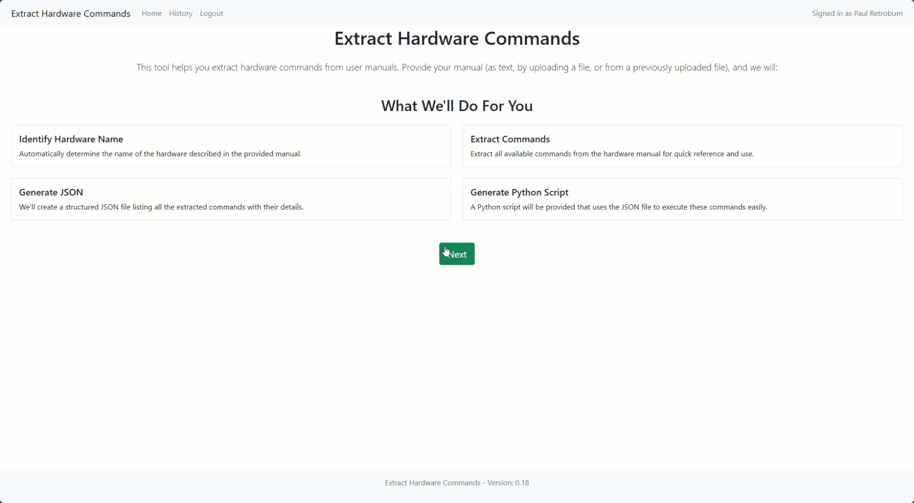

# Extract Hardware Commands

**ExtractHardwareCommands** is a Flask-based web application designed to process hardware manuals and extract relevant device information, commands, and generate structured JSON and Python scripts based on the provided documentation. This tool leverages Azure Cognitive Services and Azure OpenAI to:

1. Identify the name of hardware or devices from user manuals.
2. Extract all available commands from the provided text.
3. Generate a structured JSON representation of these commands.
4. Produce a Python script that demonstrates how to interact with these commands programmatically.

**Key Features:**

- **Content Input Options:** Provide text directly, upload files (TXT, MD, DOCX, PDF), or select from previously uploaded files.
- **Automatic Hardware Name Extraction:** Identify the hardware name from the user manual.
- **Command Extraction:** Extract commands and parameters referenced in the manual.
- **JSON Generation:** Automatically create a JSON file listing commands, their syntax, parameters, and related information.
- **Python Script Generation:** Generate a Python script template that uses the provided JSON structure as a guide to execute these commands.
- **History & Retrieval:** Store extracted results in Azure Cosmos DB for historical reference and retrieval at any time.\



------

## Prerequisites

- **Python 3.9+** recommended.
- **Flask & Flask-Session** for the web framework and session management.
- Azure Services:
  - Azure OpenAI endpoint and API key for language processing.
  - Azure Document Intelligence (Form Recognizer) endpoint and key for document extraction (PDF or scanned manuals).
  - Azure Cosmos DB endpoint and key for storing results.
  - Application Insights for logging and monitoring.
- **MSAL (Microsoft Authentication Library)** for user authentication via Azure Active Directory (optional, if you want user logins).

------

## Environment Variables

The application relies on several environment variables for configuration. Below is a summary of the key variables used:

```
bashCopy codeSCM_DO_BUILD_DURING_DEPLOYMENT="true"

# Application Insights
APPLICATIONINSIGHTS_CONNECTION_STRING="InstrumentationKey=..."
ApplicationInsightsAgent_EXTENSION_VERSION="~3"
APPLICATIONINSIGHTSAGENT_EXTENSION_ENABLED="true"
XDT_MicrosoftApplicationInsights_Mode="default"

# Flask App
FLASK_KEY="your-flask-secret-key"

# Azure OpenAI
AZURE_OPENAI_API_TYPE="azure"
AZURE_OPENAI_KEY="your-azure-openai-key"
AZURE_OPENAI_ENDPOINT="https://your-openai-endpoint/"
AZURE_OPENAI_API_VERSION="2024-02-15-preview"
AZURE_OPENAI_MODEL="gpt-4o"

# Azure Cosmos DB
AZURE_COSMOS_ENDPOINT="https://your-cosmosdb-account.documents.azure.com:443/"
AZURE_COSMOS_KEY="your-cosmosdb-key"
AZURE_COSMOS_DB_NAME="GenerateHardwareSpecs"
AZURE_COSMOS_FILES_CONTAINER_NAME="files"
AZURE_COSMOS_RESULTS_CONTAINER_NAME="results"

# Azure Document Intelligence (Form Recognizer)
AZURE_DOCUMENT_INTELLIGENCE_ENDPOINT="https://your-docanalysis-endpoint.cognitiveservices.azure.com/"
AZURE_DOCUMENT_INTELLIGENCE_KEY="your-docanalysis-key"

# Azure AD Authentication
WEBSITE_AUTH_AAD_ALLOWED_TENANTS="..."
MICROSOFT_PROVIDER_AUTHENTICATION_SECRET="..."
CLIENT_ID="..."
TENANT_ID="..."
```

Create a `.env` file or set these variables in your environment. Use `env.example` as a reference.

**Note:** Never commit secrets or keys to source control. Use secure methods like Azure Key Vault or GitHub secrets to store and reference these values.

------

## Setup and Installation

1. **Clone the Repository:**

   ```
   bashCopy codegit clone https://github.com/yourusername/ExtractHardwareCommands.git
   cd ExtractHardwareCommands
   ```

2. **Install Dependencies:**

   ```
   bash
   
   
   Copy code
   pip install -r requirements.txt
   ```

3. **Configure Environment Variables:**

   - Copy `env.example` to `.env` and fill in your secrets and keys.
   - Alternatively, set them in your environment before running the app.

------

## Running Locally

1. **Run the Flask Application:**

   ```
   bash
   
   
   Copy code
   flask run
   ```

   By default, Flask will run on `http://127.0.0.1:5000`.

2. **Access the Web Interface:** Open a browser and navigate to `http://localhost:5000`.

------

## Deploying to Azure

1. **Azure App Service Deployment:**
   - Configure your Azure Web App and enable the required Application Settings (as shown above).
   - Deploy the code using GitHub Actions, Azure DevOps pipelines, or manual deployment.
   - Ensure `SCM_DO_BUILD_DURING_DEPLOYMENT="true"` is set if using a build pipeline on Azure App Service.
2. **Configure Azure Resources:**
   - **Azure OpenAI:** Ensure you have access to the Azure OpenAI Service and a deployed model.
   - **Azure Document Intelligence (Form Recognizer):** Provide endpoint and key for PDF/text extraction.
   - **Azure Cosmos DB:** Set up your Cosmos DB account, database, and containers. The app will create containers if they don't exist.
3. **Application Insights:** Ensure `APPLICATIONINSIGHTS_CONNECTION_STRING` and related keys are correct for monitoring.

------

## Authentication Flow

The application uses Microsoft Authentication Library (MSAL) for user login with Azure Active Directory. Users can log in to access secure features (e.g., personalized file history).

- **Login:** Auth flow redirect to `https://login.microsoftonline.com`.
- **Logout:** Clears session and returns user to the home page.

If you don’t need authentication, you can disable or remove these routes and MSAL integration.

------

## Usage

1. **Choose Input Method:**
   - **Provide Text:** Directly paste your manual text into the web form.
   - **Upload Content:** Upload a DOCX, PDF, TXT, or MD file.
   - **Select File:** Retrieve previously uploaded files from Azure Cosmos DB.
2. **Process Content:**
   - Once provided, click "Proceed" to generate the results.
   - The tool will identify hardware name, extract commands, generate a JSON file, and produce a Python script.
3. **View Results:**
   - Review the extracted information, JSON, and Python script.
   - Download JSON or Python files directly.

------

## History and Results

- **History Page:**
  - View previously processed manuals, extracted commands, and results stored in Cosmos DB.
  - Search and sort results by topic or timestamp.
- **Retrieve Past Results:**
  - Click on a past result to view the hardware name, commands, JSON, and Python script associated with that manual.

------

## Customization

- **Model Adjustments:** Update the `MODEL` environment variable to change the Azure OpenAI model.
- **Prompt Tuning:** Modify the prompts in `app.py` to tailor how hardware name or commands are extracted.
- **UI Changes:** Edit templates in `templates/` to alter the look and feel of the application.
- **Storage Changes:** Adjust Cosmos DB queries or indexing policies as needed.
